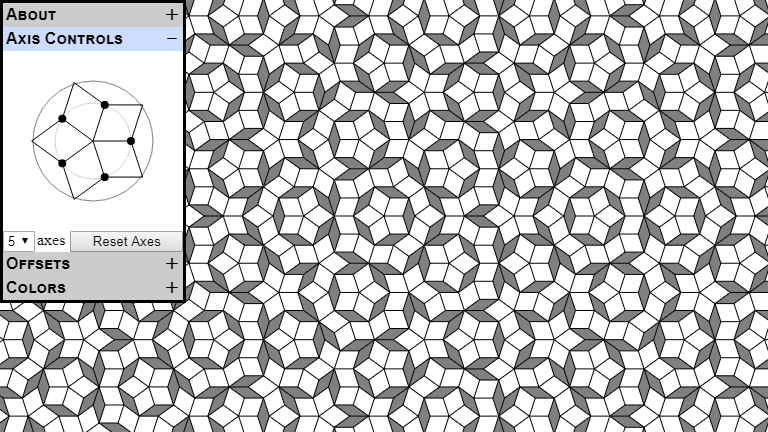

# Cut-and-Project Tiling

This applet is an interactive demonstration of cut-and-project tiling.

Cut-and-project tilings are made by a 2-dimensional plane cutting through a higher dimensional square lattice. Lattice points in the neighborhood of the cutting plane are projected onto the plane and connected by edges to create the tiling. The well-known Penrose tiling is among the many tilings that can be generated this way.

[Try it!](https://gglouser.github.io/cut-and-project-tiling/)

[Explanation of controls](docs/intro.md) and how it works.

Check out a small [gallery of examples](docs/gallery.md).

## Requirements

This applet includes a WebAssembly implementation of the tiling generator. That piece is written in Rust and uses wasm-bindgen and wasm-pack to build the wasm module. Until browser support for wasm-modules-as-ES6-modules improves, the easiest way to use a wasm module is with a bundler like webpack.

Prerequisites:

1. Install [Rust and cargo](https://www.rust-lang.org/tools/install)

2. Install [node and npm](http://nodejs.org)

3. Install [wasm-pack](https://rustwasm.github.io/wasm-pack/installer/)

4. Install project dependencies:

        npm install

To run dev server:

    npm run start

To run dev server in debug mode:

    npm run debug

To build for deployment (into `dist` subdirectory):

    npm run build

## Acknowledgments

I drew inspiration from [Quasitiler](http://www.geom.uiuc.edu/apps/quasitiler/about.html). My favorite feature borrowed from it is the axis control rosette. Before that, I was trying to control the orientation of the cutting plane with angles, and Quasitiler's way is far superior.
