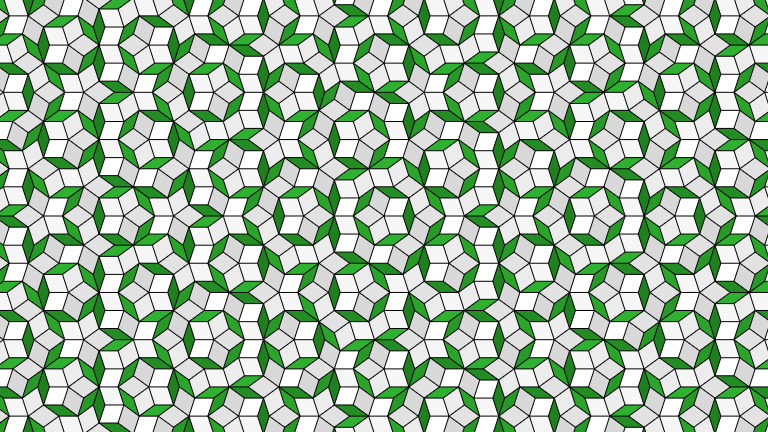
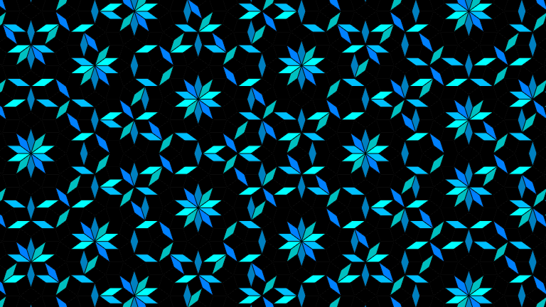
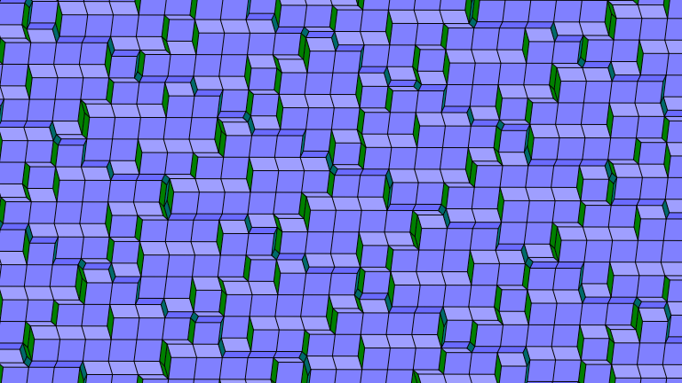
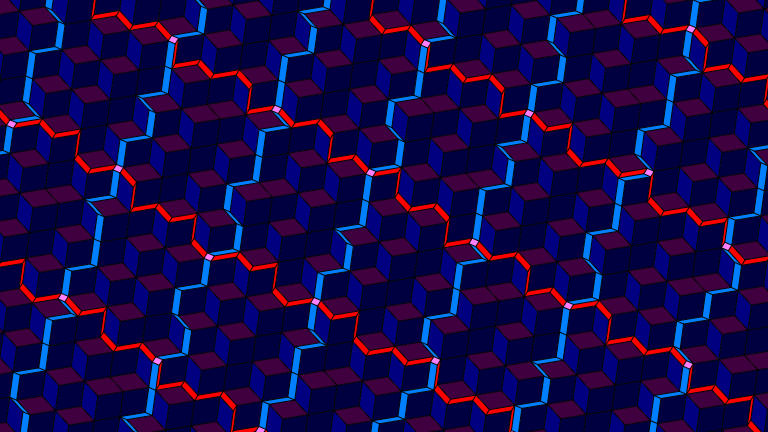
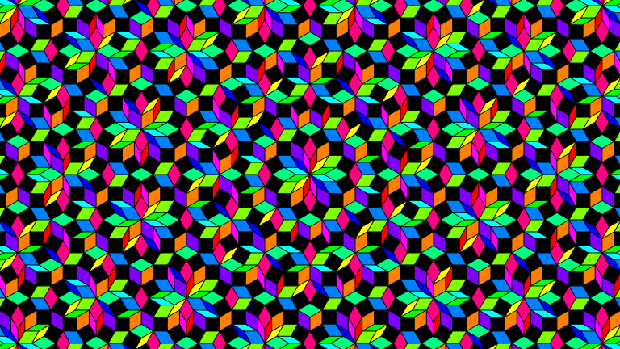
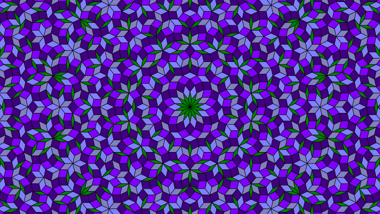

# Example Tilings

Classic Penrose tiling of thick and thin rhombs. [See this example live in the applet.](https://gglouser.github.io/cut-and-project-tiling/?a=AQVQ9BkEvoK+ghkEAABM/S+V0GuzAzw8PDw8AAAA9vb2MLAwJIwk////7OzsLKQsIIAg4uLiKJgo2NjY)

A faux-Penrose tiling. It uses the same cutting plane orientation, and therefore is made of the same thick and thin rhombs, but at a different offset so that it doesn't satisfy the edge-matching rules of a true Penrose tiling. (The thick rhombs are all colored black for visual effect.) [See this example live.](https://gglouser.github.io/cut-and-project-tiling/?a=AQVQ9BkEvoK+ghkEAABM/S+V0GuzAygoKCgoAAAAAAAAAP//AMD/AAAAAAAAAID/AIDAAAAAAMDAAAAA)

A 5-axis tiling with a different cutting plane orientation. Has a vaguely crystalline appearance. [See this example live.](https://gglouser.github.io/cut-and-project-tiling/?a=AQV61RMk8VvoiQzQAE9Aox4q6quX4jw8lDw8AAAAn5//amr/lZX/gID/AGpqAIAAAIAAAGpqAICAAIAA)

A 5-axis tiling that looks like ordinary (3-D) cubes with cracks running between them in two directions. [See this example live.](https://gglouser.github.io/cut-and-project-tiling/?a=AQVs1vEt4i3HYw7v7eBrDPMiwbfoiTw8PDw8AAAAAABAAID/QABA/wAAAID/AACA/wAAAID//4D//wAA)

A rainbow 6-axis tiling. [See this example live.](https://gglouser.github.io/cut-and-project-tiling/?a=AQZJ5kAAJPMAANsNwAEAACTzP/9J5kAAJPMAAAAAAAAAAAAA//8AgP8AAACA/wAA/wAAAP+AAP8AAAAA/4D/AP//AIAAAAD/AAD/gAD//wA=)

A flowery 7-axis tiling. [See this example live.](https://gglouser.github.io/cut-and-project-tiling/?a=AQdEayqo8MfCXMJc8McqqAAANX5CtB2v4lG9TMqCAAAAAAAAAAAAAICA/4AA/wCAAACAAEAAgICAwICA/4AA/wCAAACAAEAAgICAwEAAgACAAACAAICA/0AAgACAAICAwIAA/4CA/w==)

